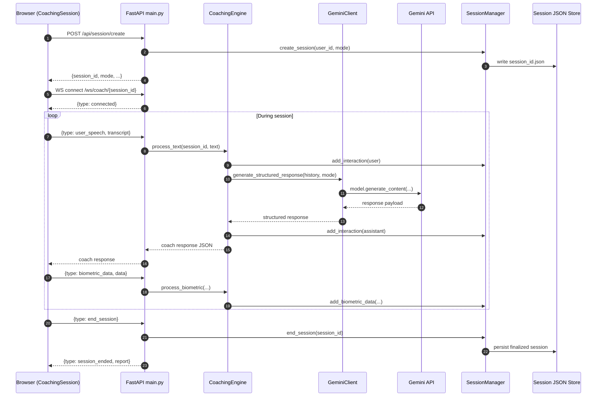
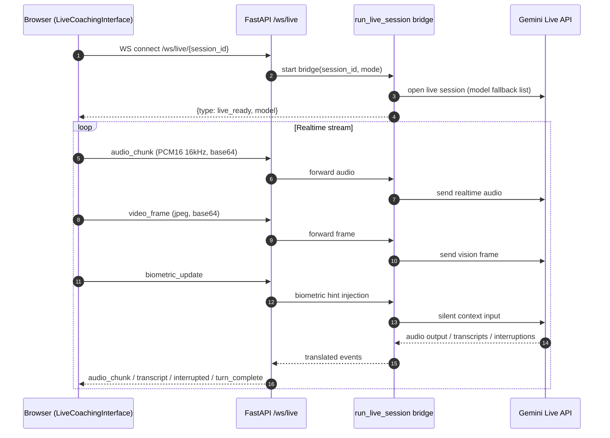
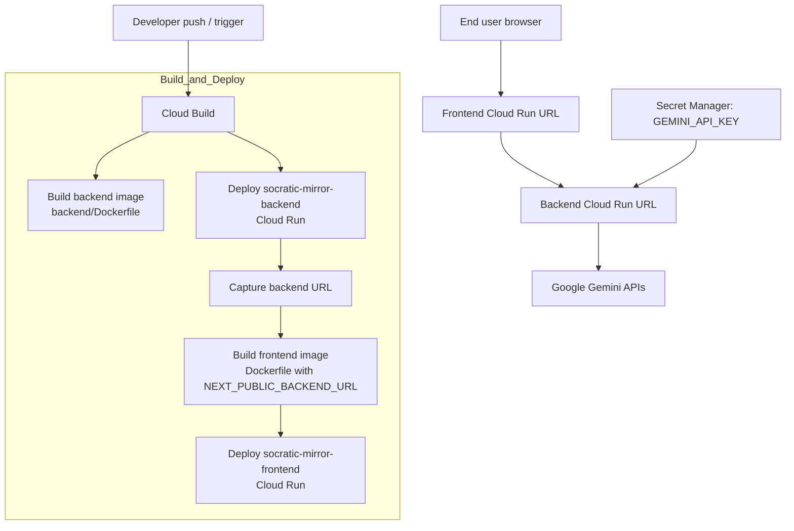

# System Architecture

This document shows how the Socratic Mirror Agent connects frontend, backend, AI services, and persistence.

## 1) Component Diagram

```mermaid
flowchart LR
    subgraph FE[Frontend - Next.js (Browser)]
        PAGE[page.tsx\nSession bootstrap]
        SESSION[CoachingSession.tsx\nMain orchestrator]
        LIVEUI[LiveCoachingInterface.tsx\nRealtime audio/video]
        BIO[BiometricMonitor.tsx\nHeart rate + stress + gaze]
        AUDIO[AudioProcessor.tsx\nSpeech recognition]
        AVATAR[AvatarScene/AvatarModel\n3D avatar + lip sync]
        WB[Whiteboard.tsx\nTutoring visuals]
        REPORTUI[VibeReport.tsx\nPost-session analytics]
    end

    subgraph BE[Backend - FastAPI]
        MAIN[main.py\nREST + WebSocket gateways]
        ENGINE[coaching_engine.py\nMode logic + orchestration]
        GCLIENT[gemini_client.py\nGemini model fallback]
        LIVEBRIDGE[live_session.py\nGemini Live bridge]
        SESS[session_manager.py\nSession lifecycle + persistence]
        TTS[tts_service.py\nOptional TTS endpoint]
    end

    GEM[Google Gemini API\nText/structured generation]
    GLIVE[Gemini Live API\nBidirectional streaming]
    GSTTS[Google Cloud TTS API\nOptional]
    STORE[(File-based session store\nbackend/sessions/*.json)]

    PAGE --> SESSION
    SESSION --> BIO
    SESSION --> AUDIO
    SESSION --> AVATAR
    SESSION --> WB
    SESSION --> REPORTUI
    SESSION --> LIVEUI

    PAGE -->|POST /api/session/create| MAIN
    SESSION <-->|WS /ws/coach/{session_id}| MAIN
    LIVEUI <-->|WS /ws/live/{session_id}| MAIN
    SESSION -->|GET report / end session| MAIN

    MAIN --> ENGINE
    MAIN --> LIVEBRIDGE
    MAIN --> SESS
    ENGINE --> GCLIENT --> GEM
    LIVEBRIDGE --> GLIVE
    MAIN --> TTS --> GSTTS

    ENGINE --> SESS --> STORE
```

## 2) Standard Coaching Sequence (/ws/coach)



## 3) Live Realtime Sequence (/ws/live)



## 4) Deployment View (Cloud Run)



## Notes

- Current persistence is file-based (`backend/sessions/*.json`), not Postgres/Redis.
- If you later add a database, replace the file-store node and keep SessionManager as the abstraction boundary.
